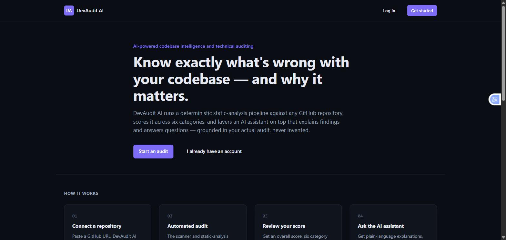
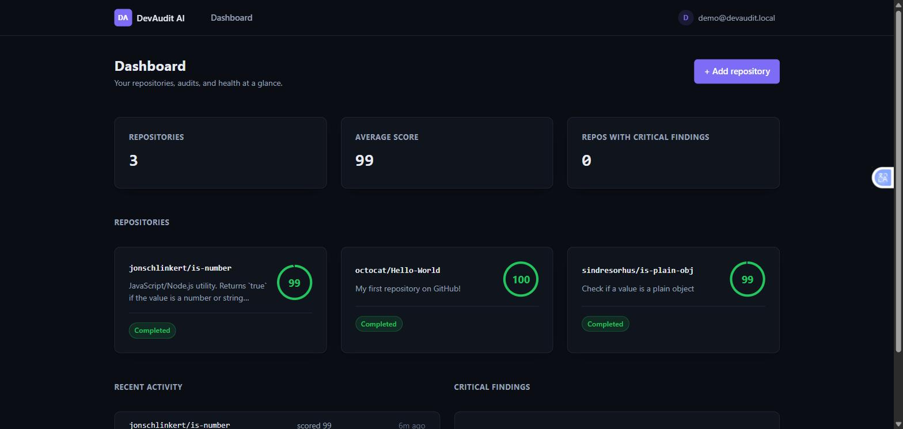
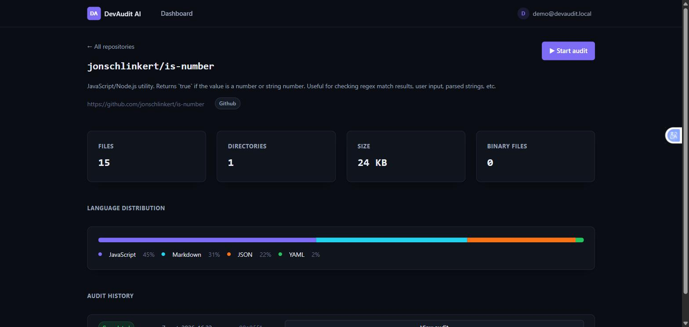
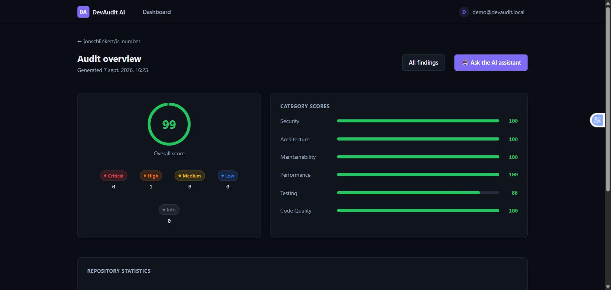
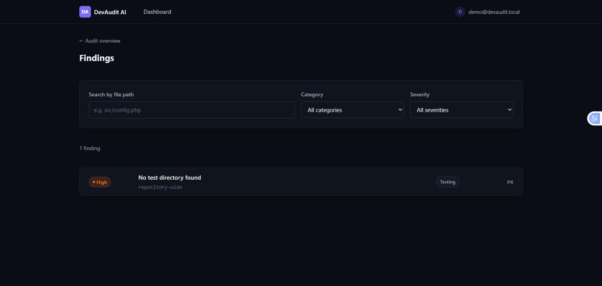
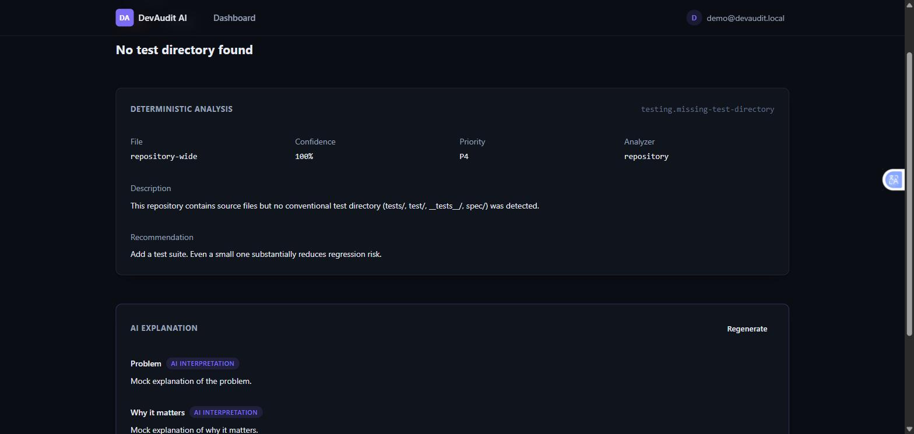
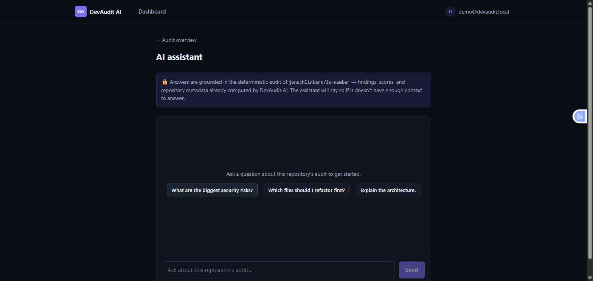
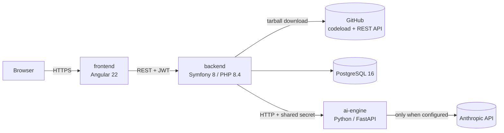

# DevAudit AI

**AI-powered codebase intelligence and technical auditing.**

DevAudit AI runs a deterministic static-analysis pipeline against any public
GitHub repository, scores it across six categories, and layers an AI
assistant on top that explains findings and answers questions — grounded in
the actual audit, never invented.

[](https://github.com/Enirack/dev-audit-ai/actions/workflows/ci.yml)

## Screenshots

| Landing | Dashboard |
|---|---|
|  |  |

| Repository detail | Audit overview |
|---|---|
|  |  |

| Findings | Finding detail + AI explanation |
|---|---|
|  |  |

| AI assistant |
|---|
|  |

> The AI screenshots above were captured with `AI_ENGINE_PROVIDER=mock` (no
> API key configured in this environment) — the "Mock explanation of the
> problem." text is the mock provider's canned response, not a real model
> output. Set `AI_ENGINE_PROVIDER=anthropic` with a real `ANTHROPIC_API_KEY`
> for genuine AI-generated text; the UI, request/response shape, and
> hallucination-guard behavior are identical either way. See
> [docs/ai.md](docs/ai.md).

## Architecture



A monorepo with four services, wired together by `docker-compose.yml`:

```
dev-audit-ai/
├── backend/     Symfony 8 API — auth, ingestion, scanning, scoring, AI proxy
├── ai-engine/   FastAPI service — the AI layer (explanations, summaries, chat)
├── frontend/    Angular 22 dashboard
├── docs/        Architecture, security, AI, scoring, and per-phase design docs
└── docker-compose.yml
```

| Doc | Covers |
|---|---|
| [docs/architecture.md](docs/architecture.md) | Service boundaries, data flow, ports, env vars |
| [docs/development.md](docs/development.md) | Running each service outside Docker |
| [docs/security.md](docs/security.md) | Full security audit: auth, SSRF, path traversal, rate limiting, CORS, etc. |
| [docs/ai.md](docs/ai.md) | Provider abstraction, context budgeting, redaction, hallucination guard |
| [docs/static-analysis.md](docs/static-analysis.md) | Rule engine, supported languages, known false-positive mode |
| [docs/scoring.md](docs/scoring.md) | The scoring formula, worked examples, priority matrix |
| [docs/frontend.md](docs/frontend.md) | Frontend structure, design system, known trade-offs |

## Features

- **GitHub ingestion** — paste a public repository URL; a source-only
  tarball is downloaded and scanned for path traversal before extraction.
  No `git clone`, no analyzed code ever executes.
- **Repository scanning** — language/extension detection, line counts, size
  and file-count statistics, framework/config-file detection (README,
  Dockerfile, CI config, lockfiles, test directories).
- **Deterministic static analysis** — regex/heuristic rules across six
  categories (Security, Architecture, Maintainability, Performance,
  Testing, Code Quality), each finding carrying a severity, a confidence
  score, and a computed priority. No AI involved in detection — the same
  input always produces the same findings.
- **Reproducible scoring** — a documented formula (diminishing returns per
  severity tier, so one critical finding outweighs a hundred low-severity
  ones) turns findings into six category scores and one overall score.
- **AI layer** — finding explanations, an executive summary, an
  architecture explanation, a prioritized refactoring plan, and a
  repository-aware chat assistant, all built on top of the deterministic
  results above and never used as a substitute for them.
- **Full dashboard** — landing page, authentication, a repository/audit
  dashboard, filterable and paginated findings, and the AI assistant, all
  in a from-scratch dark developer-tool design system.

## Supported languages

The static-analysis engine has dedicated analyzers for **JavaScript,
TypeScript, PHP, and Python**. The repository scanner detects and counts
lines for a broader set of languages (via extension), but only these four
are run through the rule engine in v1.

## AI capabilities

Provider-agnostic (`AIProvider` abstraction — mock or Anthropic today, see
[docs/ai.md](docs/ai.md)):

1. **Finding explanation** — problem, why it matters, potential impact, and
   a suggested remediation for one finding.
2. **Executive summary** — strengths, weaknesses, critical risks, and
   recommended next steps for a whole audit.
3. **Architecture explanation** — inferred from repository metadata and
   findings only (see the limitation below — there's no source code left
   to read by the time this runs).
4. **Refactoring plan** — a ranked list of priorities, each citing real
   finding ids/file paths or explicitly citing none.
5. **Repository chat** — ask questions about the audit; every citation the
   model makes is checked against what it was actually shown, and
   anything invented is stripped out with a warning rather than shown as
   fact.

Every AI endpoint response separates **deterministic data** (what Symfony
already computed), **AI interpretation**, and **AI recommendation** —
never blended into one undifferentiated block of text.

## Limitations

Read this before trusting a score or a finding at face value — this is a
v1 developer tool, not a certified security scanner:

- **Static analysis is regex/heuristic-based, not an AST parser.** It
  *will* produce false positives and false negatives. A documented example:
  a rule can flag its own pattern-definition string if that string appears
  literally in an analyzed file. See [docs/static-analysis.md](docs/static-analysis.md).
- **No source code is available to the AI layer.** The ingested workspace
  is deleted once a scan finishes; AI features work from persisted
  finding/metadata records only, never a live file tree. See
  [docs/ai.md](docs/ai.md).
- **Only 4 languages are analyzed** (JavaScript, TypeScript, PHP, Python) —
  a scanned repository in another language will show accurate file/line
  statistics but zero rule-based findings.
- **No professional security audit or penetration test** has been
  performed on DevAudit AI itself — see [docs/security.md](docs/security.md)
  for exactly what was checked.
- **Repository and scan listings are unpaginated** — fine for v1's expected
  per-user counts, not built for hundreds of repositories per account.
- Scan creation runs **synchronously** (no job queue yet) — starting an
  audit blocks the request until ingestion and analysis finish.

## Local setup

Requires Docker and Docker Compose.

```bash
git clone https://github.com/Enirack/dev-audit-ai.git
cd dev-audit-ai
cp .env.example .env   # optional — only needed for a GitHub token, the AI provider, or the internal secret
docker compose up -d --build
```

Then open **http://localhost:4200**. The backend applies migrations
automatically on startup. To populate the dashboard with a few real,
already-audited public repositories instead of starting from empty:

```bash
docker compose exec backend php bin/console app:demo:seed
```

This creates `demo@devaudit.local` / `DemoPassword123!` and runs real
audits (not fabricated data) against a couple of small public repositories.
Safe to re-run — it skips repositories that already have a completed scan
unless you pass `--refresh`.

To run each service outside Docker instead, see
[docs/development.md](docs/development.md).

## Environment variables

See [docs/architecture.md](docs/architecture.md#environment-variables) for
the full table. The ones you're most likely to touch:

| Variable | Default | Purpose |
|---|---|---|
| `GITHUB_TOKEN` | *(empty)* | Optional; raises GitHub's API rate limit from 60/hr to 5000/hr |
| `AI_ENGINE_PROVIDER` | `mock` | `mock` (no network calls) or `anthropic` |
| `ANTHROPIC_API_KEY` | *(empty)* | Required only when `AI_ENGINE_PROVIDER=anthropic` |
| `AI_ENGINE_INTERNAL_SECRET` | *(empty)* | Shared secret for backend→ai-engine auth; empty disables the check (local/dev only) |
| `CORS_ALLOW_ORIGIN` | `localhost`/`127.0.0.1` | **Must be narrowed before any real deployment** |

All secrets are read from environment variables and gitignored — never
commit a filled-in `.env`. Copy `.env.example` to `.env` to get started.

## Testing

```bash
# Backend: PHPStan (static analysis) + PHPUnit (109 tests)
cd backend && vendor/bin/phpstan analyse && vendor/bin/phpunit

# AI engine: pytest (37 tests, all against a mock provider — no API key needed)
cd ai-engine && python -m pytest

# Frontend: format check, type check, vitest (22 tests), production build
cd frontend && npm run format:check && npm run typecheck && npm test && npm run build
```

All three run in CI on every push/PR (`.github/workflows/ci.yml`) — no
workflow requires a secret, since none of the test suites make a real
network call.

## Deployment

A live, **free** deployment recipe (Neon + Render + Vercel, no credit card
anywhere) is documented step by step in
[docs/deployment-free.md](docs/deployment-free.md), including a
`render.yaml` Blueprint at the repo root.

`docker-compose.yml` as committed is a **local development** configuration
(`APP_ENV=dev`, permissive CORS, no internal secret set). Before deploying
anywhere real:

1. Set `APP_ENV=prod` for the backend (disables debug mode and stack
   traces in error responses) and provide a production `APP_SECRET`.
2. Narrow `CORS_ALLOW_ORIGIN` to your actual frontend origin.
3. Set `AI_ENGINE_INTERNAL_SECRET` to a real shared secret on both
   `backend` and `ai-engine`.
4. If using the Anthropic provider, set `AI_ENGINE_PROVIDER=anthropic` and
   `ANTHROPIC_API_KEY` on the `ai-engine` service only — the backend never
   needs it.
5. Point `DATABASE_URL` at a real, backed-up PostgreSQL instance — the
   `postgres` service here uses a named Docker volume, which is durable
   across container restarts but is not a backup strategy.

See [docs/security.md](docs/security.md#known-limitations--what-a-real-production-deployment-must-change)
for the full list.

## Roadmap (recommended v1.1)

- Paginate `GET /api/repositories` and `GET /api/repositories/{id}/scans`.
- Move scan execution off the request thread (a real job queue) so
  starting an audit doesn't block on ingestion + analysis.
- A backend aggregate endpoint for the dashboard, replacing the current
  client-side per-repository fan-out (documented in
  [docs/frontend.md](docs/frontend.md)).
- Cache/reuse the ingested workspace briefly so the AI layer can cite
  actual source snippets, not just metadata (see the limitation above).
- Additional static-analysis language support (Go, Java, Ruby).
- A real end-to-end test suite (Playwright/Cypress) covering the full
  login → audit → findings → AI assistant flow, complementing the current
  unit-test coverage and the manual verification performed each phase.

## License

Proprietary.
